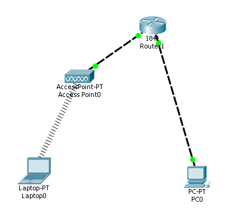
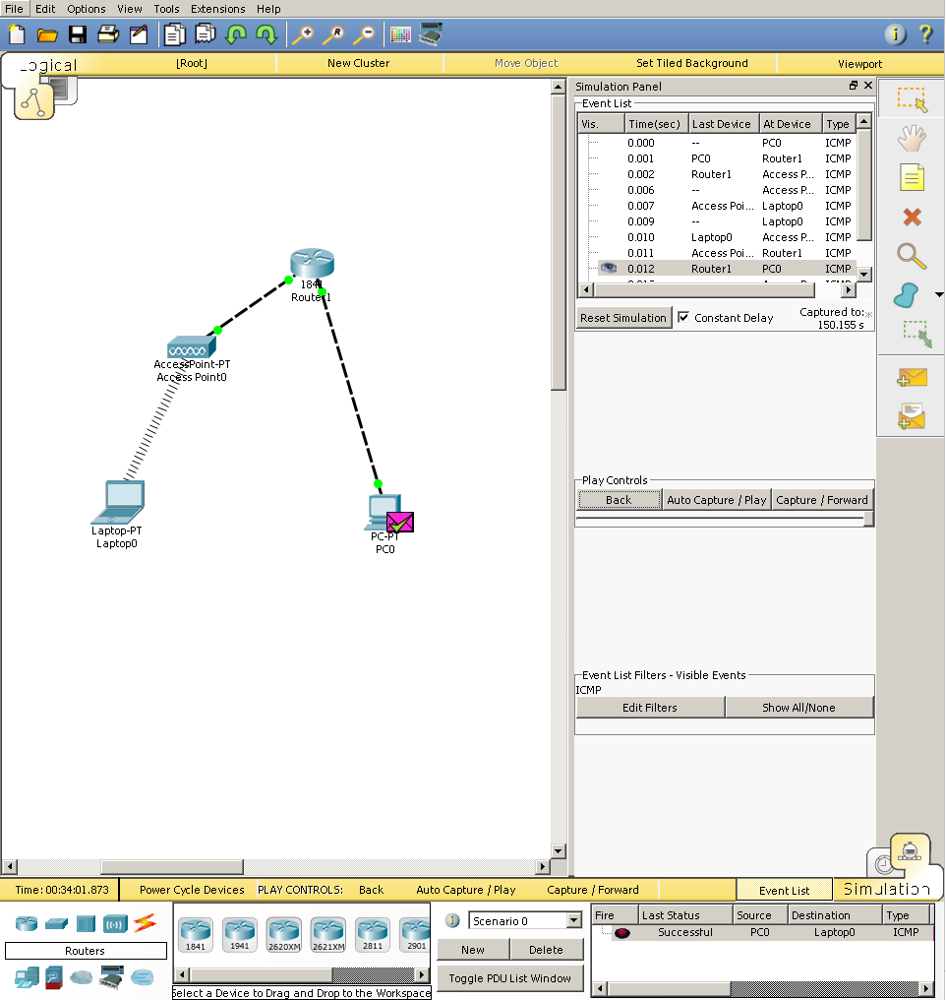
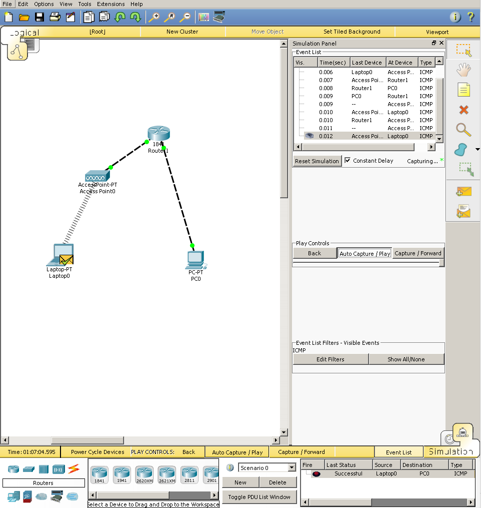

# Router

> Implementare una rete che fa capo a un router, divisa in due subnet:
>
> - PC via ethernet
> - Access Point via ethernet
>   - Laptopt via WiFi

- 1847 Router1
  - FastEthernet0/0
    - IP Adress: `176.1.4.5 \16`
  - FastEthernet0/1
    - IP Adress: `192.168.11.3 \24`
- PC-PT PC0
  - IP Adress: `192.168.11.3 \24`
  - Gateway: `192.168.11.4`
- AccessPoint-PT Access Point0
- Laptop-PT Laptop0
  - IP Adress: `176.1.4.5 \16`
  - Gateway: `176.1.2.3`

### Ping test

+ PC0 -> Laptop0

  

+ Laptop0 -> PC0

  