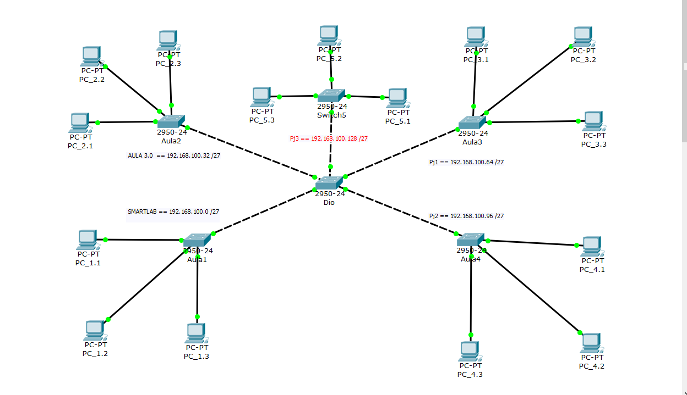
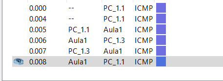
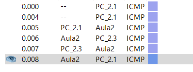
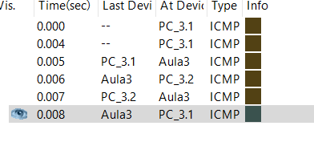
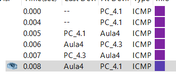
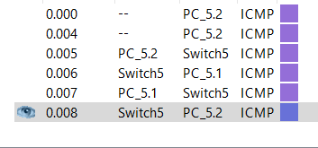

# Subnetting in cisco

Progrttare una LAN composta da `5` sottoreti:

+ `aula3.0`
+ `smartlab`
+ `Pj1`
+ `Pj2`
+ `Pj3`

Indirizzo di rete: `192.168.100.0/24`

1. Quale subnet è necessaria?
2. Per ognuna delle sottoreti trovare:
   1. Indirizzo di rete
   2. Primo e ultimo indirizzo assegnabile ad un host
   3. Indirizzo di broadcast
3. Progettare al rete in Cisco Packet Tracer e verificare con dei Ping.

## 1

Per suddividere `5` sottoreti servono `3` bit, quindi ogni sottorete avrà subnet mask di: `/24 + 3 = /27`

La subnet sarà dunque: `255.255.255.224`

## 2

### aula3.0: `192.168.100.0/27`

Host: 

+ `192.168.100.1/27`
+ ...
+ `192.168.100.30/27`

Broadcast:

+ `192.168.100.31/27`

### smartlab: `192.168.100.32/27`

Host: 

+ `192.168.100.33/27`
+ ...
+ `192.168.100.62/27`

Broadcast:

+ `192.168.100.63/27`

### Pj1: `192.168.100.64/27`

Host: 

+ `192.168.100.65/27`
+ ...
+ `192.168.100.94/27`

Broadcast:

+ `192.168.100.95/27`

### Pj2: `192.168.100.96/27`

Host: 

+ `192.168.100.97/27`
+ ...
+ `192.168.100.126/27`

Broadcast:

+ `192.168.100.127/27`

### Pj3: `192.168.100.128/27`

Host: 

+ `192.168.100.129/27`
+ ...
+ `192.168.100.158/27`

Broadcast:

+ `192.168.100.159/27`

## 3

### Rete:

### Esecuzione dei ping interni alle subnets:

##### smartlab:

##### aula3.0:

)

##### Pj1:

)

##### Pj2:

##### Pj3:

)

> Come si può notare tutti i ping interni alle sottoreti terminano con stato `successfull`

### Esecuzione del ping esterno alle subnets:

##### Pj2 -> aula3.0

> Dato il sistema di subnet cha abbiamo costruito, non ci stupisce notare che i ping tra subnet diverse falliscono.